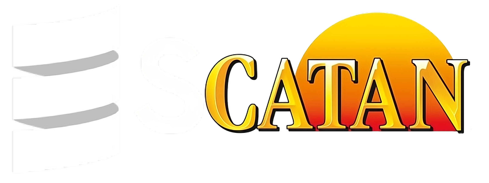

<!-- Improved compatibility of back to top link: See: https://github.com/othneildrew/Best-README-Template/pull/73 -->

<!-- PROJECT SHIELDS -->
<!--
*** I'm using markdown "reference style" links for readability.
*** Reference links are enclosed in brackets [ ] instead of parentheses ( ).
*** See the bottom of this document for the declaration of the reference variables
*** for contributors-url, forks-url, etc. This is an optional, concise syntax you may use.
*** https://www.markdownguide.org/basic-syntax/#reference-style-links
-->

[![Contributors][contributors-shield]][contributors-url]
[![Forks][forks-shield]][forks-url]
[![Stargazers][stars-shield]][stars-url]
[![Issues][issues-shield]][issues-url]
[![MIT License][license-shield]][license-url]

<!-- PROJECT LOGO -->
 

  

<h3 align="center">Scatan</h3>

  

    A game based on building, trading and farming resources, a clone of Settlers of Catan in a web environment.
     
    <a href="https://github.com/zucchero-sintattico/pps-22-scatan"><strong>Explore the docs »</strong></a>
     
     
    <a href="https://github.com/zucchero-sintattico/pps-22-scatan">View Demo</a>
    ·
    <a href="https://github.com/zucchero-sintattico/pps-22-scatan/issues">Report Bug</a>
    ·
    <a href="https://github.com/zucchero-sintattico/pps-22-scatan/issues">Request Feature</a>
  

<!-- TABLE OF CONTENTS -->

  
Table of Contents

  <ol>
    <li>
      <a href="#about-the-project">About The Project</a>
      <ul>
        <li><a href="#built-with">Built With</a></li>
      </ul>
    </li>
    <li>
      <a href="#getting-started">Getting Started</a>
      <ul>
        <li><a href="#prerequisites">Prerequisites</a></li>
        <li><a href="#installation">Installation</a></li>
      </ul>
    </li>
    <li><a href="#usage">Usage</a></li>
    <li><a href="#contributing">Contributing</a></li>
    <li><a href="#license">License</a></li>
    <li><a href="#contact">Contact</a></li>
  </ol>

<!-- ABOUT THE PROJECT -->

## About The Project

The goal of the project is to create a clone of the board game "Settlers of Catan," a game for 3 or 4 players.

In the game, each participant takes on the role of a settler trying to establish themselves on the island of Catan. The primary objective is to accumulate essential resources, including wood, clay, wheat, wool, and ore, through the construction of strategically placed settlements, cities, and roads on the island. These resources are obtained based on the results of dice rolls and the location of the structures built.

### Built With

- Scala 3
- Scala.js
- SBT
- Scoverage
- ScalaTest

<!-- GETTING STARTED -->

## Getting Started

You can play the game by clicking on the following link: [Scatan](https://zucchero-sintattico.github.io/pps-22-scatan/)

<!-- CONTRIBUTING -->

## Contributing

Contributions are what make the open source community such an amazing place to learn, inspire, and create. Any contributions you make are **greatly appreciated**.

If you have a suggestion that would make this better, please fork the repo and create a pull request. You can also simply open an issue with the tag "enhancement".
Don't forget to give the project a star! Thanks again!

1. Fork the Project
2. Create your Feature Branch (`git checkout -b feature/AmazingFeature`)
3. Commit your Changes (`git commit -m 'Add some AmazingFeature'`)
4. Push to the Branch (`git push origin feature/AmazingFeature`)
5. Open a Pull Request

<!-- LICENSE -->

## License

Distributed under the MIT License. See [LICENSE](https://github.com/zucchero-sintattico/pps-22-scatan/blob/feature-readme/LICENSE) for more information.

<!-- CONTACT -->

## Contact

Zucchero Sintattico on Instagram - [@Instagram page](https://www.instagram.com/zucchero_sintattico/)

Project Link: [https://github.com/zucchero-sintattico/pps-22-scatan](https://github.com/zucchero-sintattico/pps-22-scatan)

## Acknowledgements

- [Luigi Borriello](https://www.linkedin.com/in/luigi-borriello/)
- [Alessandro Mazzoli](https://www.linkedin.com/in/alessandro-mazzoli-009868140/)
- [Manuel Andruccioli](https://www.linkedin.com/in/manuel-andruccioli-9259a5189/)

(<a href="#readme-top">back to top</a>)

<!-- MARKDOWN LINKS & IMAGES -->
<!-- https://www.markdownguide.org/basic-syntax/#reference-style-links -->

[contributors-shield]: https://img.shields.io/github/contributors/zucchero-sintattico/pps-22-scatan.svg?style=for-the-badge
[contributors-url]: https://github.com/zucchero-sintattico/pps-22-scatan/graphs/contributors
[forks-shield]: https://img.shields.io/github/forks/zucchero-sintattico/pps-22-scatan.svg?style=for-the-badge
[forks-url]: https://github.com/zucchero-sintattico/pps-22-scatan/network/members
[stars-shield]: https://img.shields.io/github/stars/zucchero-sintattico/pps-22-scatan.svg?style=for-the-badge
[stars-url]: https://github.com/zucchero-sintattico/pps-22-scatan/stargazers
[issues-shield]: https://img.shields.io/github/issues/zucchero-sintattico/pps-22-scatan.svg?style=for-the-badge
[issues-url]: https://github.com/zucchero-sintattico/pps-22-scatan/issues
[license-shield]: https://img.shields.io/github/license/zucchero-sintattico/pps-22-scatan.svg?style=for-the-badge
[license-url]: https://github.com/zucchero-sintattico/pps-22-scatan/blob/master/LICENSE.txt
[linkedin-shield]: https://img.shields.io/badge/
