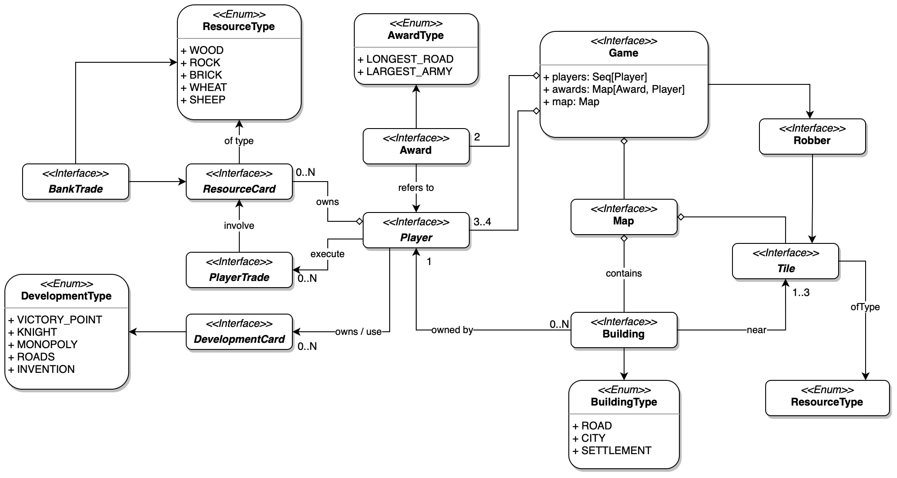
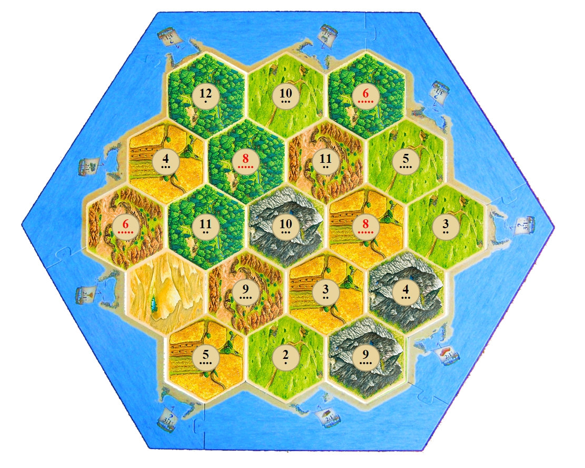

# Requisiti

## Business

- Creazione di un applicativo che permetta di giocare a Coloni di Catan implementando parte delle regole ufficiali del gioco da tavolo.
- Il gioco deve essere implementato in modo da poter essere giocato in 3 o 4 giocatori, in modalità hot-seat.

## Modello di dominio

Per la realizzazione del dominio, è stato preso come riferimento il gioco da tavolo originale, con parte le sue regole ufficiali.
Di seguito sarà riportata una descrizione più dettagliata del nostro dominio applicativo.

### Campo di gioco

La mappa di gioco è composta da tasselle esagonali che, unite tra loro a nido d'ape, formano il terreno di gioco. L'incrocio di 3 esagoni determina una zona di costruzione per edifici, le quali sono collegate tra loro da strade. Inoltre, ogni tassella ha una tipologia di terreno ed un numero che indica il valore di lancio dei dadi per raccogliere le risorse.

## Funzionali

### Utente

- L'utente deve poter interagire con l'applicazione tramite un'interfaccia grafica disponibile online.
- L'utente deve poter visualizzare il menu principale all'avvio dell'applicazione.
- L'utente deve poter creare una nuova partita, scegliendo il numero di giocatori (3 o 4) e il nome di ogni giocatore.
- L'utente deve poter vedere il campo di gioco una volta iniziata la partita.
- L'utente deve poter gestire il posizionamento iniziale delle colonie e delle strade, seguendo le regole del gioco.
- L'utente deve ricevere le risorse iniziali in base al posizionamento delle colonie.
- L'utente deve poter vedere le carte risorsa che possiede in mano.
- L'utente deve poter vedere le carte sviluppo posizionate e/o giocate.
- L'utente deve poter effettuare il suo turno sapendo in quale fase si trova.
- L'utente deve poter lanciare i dadi per raccogliere le risorse.
- L'utente deve poter effettuare scambi con gli altri giocatori.
- L'utente deve poter effettuare scambi con la banca.
- L'utente deve poter costruire strade, colonie e città con le risorse possedute e i vincoli del gioco.
- L'utente deve poter acquistare le carte sviluppo.
- L'utente deve poter giocare le carte sviluppo.
- L'utente deve poter sapere chi detiene i certificati di strada più lunga e armata più grande.
- L'utente deve poter spostare il brigante e rubare una carta ad un altro giocatore quando lancia i dadi e ottiene un 7.
- L'utente deve poter vedere quando un giocatore raggiunge i 10 punti vittoria e quindi vince la partita.
- L'utente deve poter giocare con mappe diverse, con disposizioni casuali delle tessere, potendo selezionare la mappa da utilizzare nel menu di setup.

### Sistema

- Il sistema deve poter gestire più pagine, tra cui il menu principale, la pagina di gioco e la pagina di fine partita.
- Il sistema deve poter creare una nuova partita, inizializzando il campo di gioco e le risorse di ogni giocatore.
- Il sistema deve poter gestire il posizionamento iniziale delle strade e delle colonie di tutti i giocatori, seguendo le regole del gioco.
- Il sistema deve poter gestire il turno di ogni giocatore, permettendo di effettuare scambi o costruzioni.
- Il sistema deve poter riconoscere la fine del turno di ogni giocatore, passando al giocatore successivo.
- Il sistema deve poter gestire il lancio dei dadi:
  - permettendo a tutti i giocatori di raccogliere opportunamente le risorse
  - oppure di far spostare il brigante e poi rubare una carta al giocatore di mano nel caso esca 7
- Il sistema deve poter visualizzare il campo di gioco.
- Il sistema deve poter visualizzare le risorse di ogni giocatore.
- Il sistema deve poter visualizzare le costruzioni di ogni giocatore.
- Il sistema deve poter visualizzare le azioni disponibili.
- Il sistema deve poter visualizzare le carte di sviluppo di ogni giocatore.
- Il sistema deve poter gestire il commercio di risorse tra i giocatori.
- Il sistema deve poter verificare quali giocatori detengono i certificati di strada più lunga e armata più grande.
- Il sistema deve poter gestire la fine della partita, controllando se un giocatore ha raggiunto i 10 punti vittoria.

## Non funzionali

- Usabilità: l'interfaccia grafica deve essere semplice e intuitiva.
- Affidabilità: l'applicazione deve essere stabile, evitando crash.
- Documentazione: l'intero progetto deve essere ben documentato, in modo da facilitare la comprensione del codice.
- Performance: l'applicazione deve essere veloce e reattiva, evitando prolungate attese per l'utente nello svolgimento delle azioni.
- Portabilità: l'applicazione deve essere disponibile su più piattaforme.
- Manutenibilità: il codice deve essere ben strutturato e facilmente manutenibile.

## Implementazione

Utilizzo di:

- Scala 3.3.0
- ScalaTest 3.3.x
- JDK 17+
- ScalaJS 1.13.x

## Requisiti Opzionali:

- Gestione delle Partite: fornire un sistema per iniziare, mettere in pausa, salvare e caricare partite in corso.
- Classifiche e Statistiche: aggiungere un sistema di classifiche e statistiche per tenere traccia delle prestazioni dei giocatori nel tempo.
- Modalità Multiplayer Online: implementare una modalità multiplayer online che consenta a giocatori da diverse posizioni di partecipare alle partite.
- Editor di Mappe: realizzare un editor di mappe per consentire ai giocatori di creare le proprie disposizioni del campo di gioco.
