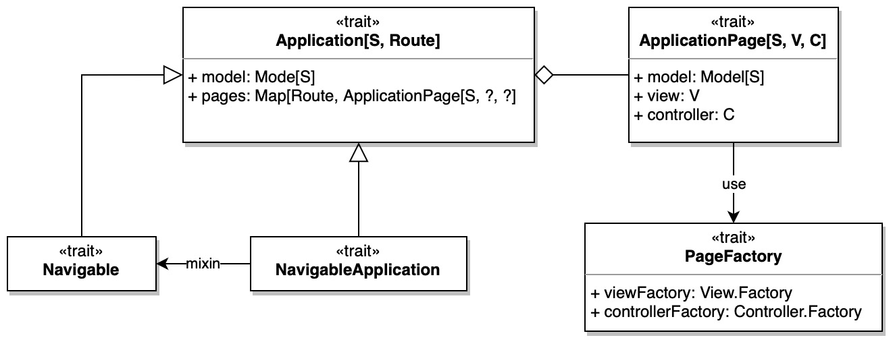
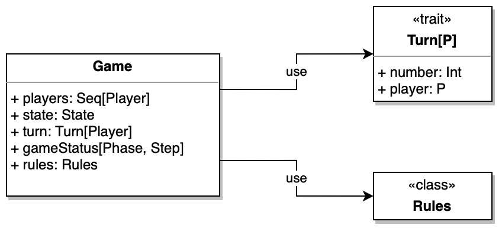

# Design di dettaglio

## Organizzazione del codice

Il codice è organizzato in 5 package principali:

- `model` contiene le classi che implementano la logica di business dell'applicazione, ovvero le regole del gioco e che permettono di gestire il suo svolgimento.
- `views` contiene le entità che permettono di visualizzare lo stato dell'applicazione all'utente e che ne permetto l'interazione diretta tramite un interfaccia grafica.
- `controllers` contiene le entità che permettono di gestire le interazioni dell'utente con l'applicazione, ovvero quelle che implementano la logica di accesso e aggiornamento del Model.
- `utils` contiene le classi di utilità, ovvero quelle che implementano funzionalità di supporto.
- `lib` contiene i module sviluppati che sono diventati parte fondamentale del progetto.
  Tra questi troviamo:
  - `mvc` contenente le classi che implementano il pattern architetturale MVC scelto per il progetto e tutte le sue componenti.
  - `game` contenente le classi che implementano un engine di gioco generico, che può essere utilizzato per implementare giochi basati su fasi, step e azioni.
    All'interno di questo package troviamo anche il `dsl` che permette di definire un gioco in modo dichiarativo.

<!--************ MAZZOLI *****************-->

## Architettura

### Model

Il Model consiste nello stato dell'applicazione, che viene modificato tramite l'applicazione di un'azione di update.
Lo stato che viene esposto è quindi sempre un oggetto immutabile che quindi può essere condiviso tra le varie componenti dell'applicazione.

### Controller

Per quanto riguarda la gestione dei Controller l'aggiornamento dello stato alla view è automatizzato tramite l'utilizzo di un `ReactiveModelWrapper` che incapsula il vero model e ad ogni modifica dello stato, notifica la view del cambiamento.

La struttura del Controller è ispirata al Cake Pattern, portando quindi il concetto di dipendenza ma venendo poi gestita con il passaggio di tali requirements tramite costruttore.

### View

Anche nelle View vengono sfruttati i Mixin, in particolare per supportare la navigabilità tra le varie schermate dell'applicazione e per l'integrazione di ScalaJS.
Il Mixin `ScalaJSView` infatti si occupa di gestire le funzionalità di _show_ e _hide_ tramite render con Laminar, mentre il Mixin `NavigatorView` si occupa di gestire la navigazione tra le varie schermate dell'applicazione.

Inoltre la `ScalaJSView` espone anche uno stato reattivo che può essere utilizzato nelle varie View e viene tenuto sempre aggiornato ad ogni modifica propagata dal controller. Questo rende semplice lo sviluppo delle views, in quanto tutto quello mostrato graficamente è dipendente dallo stato reattivo e viene aggiornato automaticamente.

### Application

Per completare la gestione di MVC vi è il componente `ApplicationPage`, ovvero l'istanza di una pagina dell'applicazione che consiste nella referenza del Model, del Controller e della View.
Questo componente serve per costruire insieme le componenti di View, Model e Controller e collegarle tra loro.

Il componente responsabile poi della gestione di queste pagine è l'`Application` che gestisce il mapping dalla `Route` all'istanza di `ApplicationPage` corrispondente.

## Game Engine

Un Game consiste nell'insieme delle seguenti proprietà:

- Dei giocatori
- Lo stato del gioco
- Il turno
- La fase e lo step della fase in cui si trova il gioco
- Un insieme di regole.

### Game

La classe `Game` rappresenta il core del gioco, ovvero il suo stato.

#### GameOPS

Poiché ora il Game consiste solo in uno snapshot di un gioco, le sue funzionalità vengono esposte tramite insiemi coerenti di operations su di esso.
Tra queste troviamo:

- `GamePlayOps` che contiene le operations per gestire le azioni dei giocatori. Esso infatti aggiunge funzionalità quali:
  - `canPlay` che utilizzando le `Rules` capisce quali azioni sono possibili in quale fase e step e in quale stato si va a finire se si esegue quell'azione.
  - `play` che permette di eseguire l'azione e di passare allo stato successivo.
    Infatti l'azione viene incapsulato nel concetto di `Effect`, che altro che non è un mapping dallo stato attuale ad uno stato successivo, che può però non essere applicabile.
- `GameTurnOps` aggiunge la funzionalità di gestione del turno, ovvero di passaggio da un giocatore all'altro.
- `GameWinOps` espone come funzionalità la gestione della vittoria di un giocatore, ovvero la verifica se un giocatore ha raggiunto i punti vittoria necessari per vincere la partita.
  Tramite di esso non solo è possibile sapere se la partita è finita ma è possibile sapere se c'è e chi è il vincitore.

### Rules

Il concetto di `Rules` incapsula tutte le regole del modello di gioco che comprendono tra i principali concetti:

- Fase iniziale
- Numero di giocatori
- Configurazione per ogni fase tra cui:
  - Step iniziale
  - Step in cui termina il turno
  - Iteratore dei giocatori
  - Configurazione dei vari step tra cui:
    - Per ogni azione possibile lo step di arrivo

## ScatanGame

#### Dominio

Il dominio del gioco è stato modellato nel seguente modo:

Poiché ad ogni azioni corrisponde esattamente un solo stato di arrivo si è dovuto differenziare il lancio dei dati in due azioni distinte:

- `RollDice` che rappresenta il lancio dei dadi quando esce un numero diverso da 7
- `RollSeven` che rappresenta il lancio dei dadi quando esce 7

In questo modo si è potuto differenziare le due azioni con le relative conseguenze.

A questo punto una volta definito il dominio del gioco si è andato a definire un layer anti-corruzione che nascondesse il dominio del gioco e che esponesse solo le funzionalità necessarie per la gestione del gioco, ma che all'interno sfrutti l'engine e il dominio scelto.

<!--************* ---- ****************-->

<!-- Borriello -->

## Stato della partita

Lo stato della partita è modellato tramite un entità rinominata `ScatanState`,
nella quale son presenti tutte le informazioni a riguardo, rappresentandone uno Snapshot.
In particolare vi sono contenute le seguenti informazioni:

- la lista dei giocatori
- la mappa di gioco
- la lista di edifici assegnati ai giocatori
- la lista di premi assegnati ai giocatori
- le liste di carte risorse assegnate ai giocatori
- le liste di carte sviluppo assegnate ai giocatori
- il mazzo di carte sviluppo
- la posizione del ladro

### Componenti del gioco & Operations

Le informazioni precedentemente elencate sono modellate come componenti (es: `Award`, `Buildings`, `ResourceCard`, ...), del gioco, molti di questi indipenti tra loro.
In seguito, a ciò le operations per gestire queste singole parti del dominio sono realizzate indipendentemente, optando quindi per un approccio modulare facile da estendere e mantenere.
Inoltre, così facendo, il core della partita (`ScatanState`) risulta essere indipendente dalle funzionalità del gioco.

#### Resource Cards Ops

- `ResourceCardOps`: contiene le operations per gestire le carte risorse, fornendo funzionalità per:
  - aggiungere carte risorsa: utilizzabile in seguito al lancio dei dadi e in seguito alla fase iniziale
  - rimuovere carte risorsa: utili per l'acquisto di carte sviluppo e per la costruzione di edifici
  - rubare carte risorsa: utili per il furto tramite il ladro e in seguito al "7 ai dadi"

#### Development Cards Ops

- `DevelopmentCardOps`: contiene le operations per gestire le carte sviluppo, fornendo funzionalità che permettono ad un giocatore di:
  - aggiungere carte sviluppo al proprio mazzo effettuandone un acquisto
  - giocare carte sviluppo dal proprio mazzo applicando gli effetti di queste ultime sulla partita
  - rimuovere carte sviluppo dal proprio mazzo in seguito all'uso di queste ultime

#### Buildings Ops

- `BuildingOps`: contiene le operations per gestire gli edifici, aggiungendo funzionalità per:
  - assegnare edifici ai giocatori in seguito alla fase iniziale di preparazione
  - far costruire edifici ai giocatori in seguito all'acquisto di questi ultimi, verificando che il giocatore abbia le risorse necessarie e che la posizione scelta sia valida

#### Awards Ops

- `AwardOps`: contiene l'operazione per calcolare i premi allo stato attuale della partita, in particolare:
  - il premio per il giocatore con il maggior numero di strade
  - il premio per il giocatore con il maggior numero di carte sviluppo di tipo cavaliere

#### Trade Ops

- `TradeOps`: contiene le operations per gestire gli scambi, permettendo ai giocatori di:
  - scambiare carte risorsa con altri giocatori
  - scambiare carte risorsa con la banca

#### Score Ops

- `ScoreOps`: contiene l'operazione per calcolare il punteggio di un giocatore, in particolare:
  - il punteggio per gli edifici costruiti
  - il punteggio per le carte sviluppo di tipo 'punto vittoria'
  - il punteggio per i premi
  - il punteggio totale

#### Robber Ops

- `RobberOps`: contiene le operations per gestire il ladro, permettendo ai giocatori di:
  - spostare il ladro in una nuova posizione

## Map

L'analisi del dominio ha portato alla schematizzazione della mappa di gioco, con i seguenti elementi:

- **Tile**: tassella esagonale che ha un contento
- **Content**: contenuto di un Tile
- **Spot**: incrocio tra 3 Tile adiacenti
- **Road**: connessione tra 2 Spot vicini

A fronte di ciò si identifica la classe `GameMap` come entrypoint per questa sotto parte di dominio. In ottica di poter espandere il campo di gioco (AOC), la mappa può essere creata con un numero di _layers_ variabile. Inoltre, per favorire la singola responsabilità dei componenti (SRP), viene separato il concetto di struttura della mappa e ciò che un tassello può contenere: l'entità appena introdotta mette in relazione i due concetti.

Da ciò ne risulta il seguente schema:

#### Struttura della mappa

La struttura della mappa è rappresentata dalla classe `HexagonalTiledMap`, che si occupa di una costruzione coerente, partendo dall'unità minima, l'`Hexagon`.

Questo componente è basato su [_coordinate cubiche_](https://www.redblobgames.com/grids/hexagons/#coordinates) che permettono di identificare univocamente ogni tassello della mappa.

A seguito della relazione tra `HexagonalTiledMap` e `Hexagon`, quest'ultimo acquisisce il concetto di spazio con annessi metodi per posizioni relative ed assolute.

La seconda parte di `HexagonalTiledMap` concerne la vista di essa come un _grafo non orientato_:

$$ G = (N, E) $$

Con \\( N \\) insieme dei nodi ed \\( E \\) insieme degli archi, dove \\( E \subseteq V \times V \\).

A partire da ciò è possibile identificare gli `StructureSpot` come nodi del grafo, composti da una tripla non ordinata di 3 `Hexagon` adiacenti, ed i `RoadSpot` come archi, composti da una coppia di 2 `StructureSpot` vicini.

A fronte di questa modellazione nascono le seguenti implicazioni logiche:

- \\( \forall r \in \texttt{Edge} \Rightarrow \\{a, b\\} \\; | \\; a, b \in \texttt{Nodes} \\)
- \\( \forall s \in \texttt{Nodes} \Rightarrow \\{a, b, c\\} \\; | \\; a, b, c \in \texttt{Hexagons} \\)

Inoltre, la distinzione tra `UndirectedGraph` e `UndirectedGraphOps` permette di separare la logica di rappresentazione del grafo da quella che contempla operazioni su di esso.

#### Contenuto dei tasselli

Il contenuto dei tasselli, precedentemente introdotto, è ora approfondito.
La sua funzione è quella di attribuire, ad ogni tassello della mappa, il suo contenuto, che è composto da un terreno ed un numero opzionale.

I terreni possono essere di 2 tipi:

- **Produttivi**: che riutilizzano il concetto di risorsa introdotto nel dominio
- **Non produttivi**: terreni inutili ai fini della produzione di risorse, ma presenti per completare i requisiti del gioco

#### Costruzione della mappa

La creazione della mappa di gioco può essere effettuata attraverso la classe stessa, per libertà di scelta dell'utente, ma sono state predefinite delle _factory_ per far fronte alle esigenze più comuni, date dalle regole del gioco.

Al fine di modificare la mappa, ciò che viene cambiato è solo il contenuto dei tasselli.
Perciò è possibile definire delle `TileContentStrategy` che permette di modificare il contenuto dei tasselli alla costruzione della mappa stessa.

## View

La View, come precedentemente introdotto, permette all'utente di visualizzare lo stato dell'applicazione in modo reattivo, e consentire l'interazione con il sistema.
È possibile notare una differente complessità tra le varie schermate dell'applicazione: la schermata di gioco è la più complessa, in quanto deve mostrare lo stato attuale di avanzamento della partita, e consentire le varie interazione permesse, mentre le altre contengono un minor numero di elementi, in quanto devono solo consentire all'utente di proseguire e/o navigare all'interno dell'applicazione.

A fronte di ciò, è stato scelto di utilizzare un approccio a componenti per la realizzazione schermate più dense di elementi, mentre per le altre è stato scelto un approccio più semplice, basato su un unico elemento.

Inoltre, l'approccio a componenti, permette il riutilizzo del codice in sezioni diverse dell'applicazione.

### ViewModel

Per la gestione di tutti i mapping da stato dell'applicazione a singola informazione, è presente il concetto di ViewModel, che consiste in un wrapper dello stato reattivo dell'applicazione e che tramite operations su di esso espone tutti i vari metodi per ottenere le informazioni dipendenti dallo stato.

### Context Map e Anti Corruption Layer

L'obiettivo della view di mostrare lo stato del model in modo reattivo contempla la necessità di tradurre le informazioni contenute nel model in elementi grafici, significativi per l'utente.

Il più delle volte, la traduzione è diretta mentre, in alcuni casi, è necessario effettuare delle trasformazioni di contesto, per rendere più significative le informazioni.

Per ovviare a questo problema è stato introdotto il concetto di `Context Map`, luogo che permette di tradurre le informazioni del model in elementi grafici, wrappando il model stesso.

Questo meccanismo funge anche da `Anti Corruption Layer`, in quanto permette di rimuovere la dipendenza diretta tra model e alcune parti della view, risultando l'unico punto dove sono richieste modifiche in caso di cambiamenti nel model.

