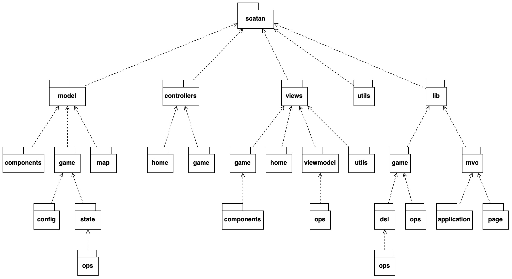
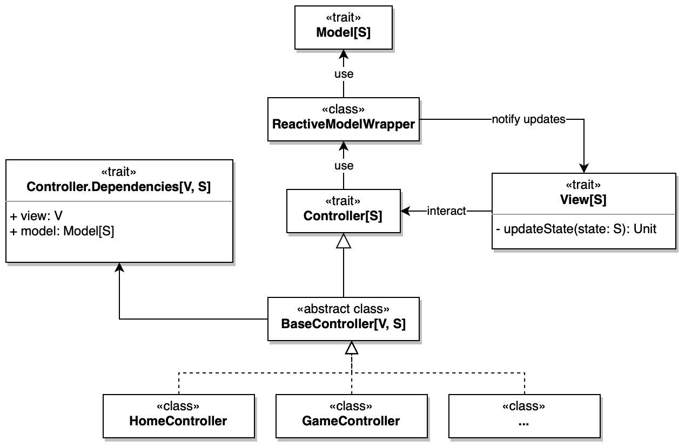
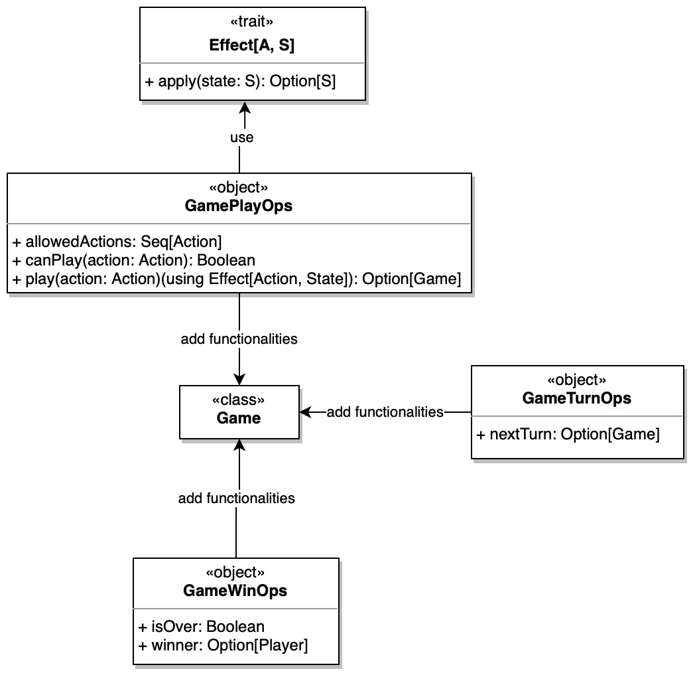
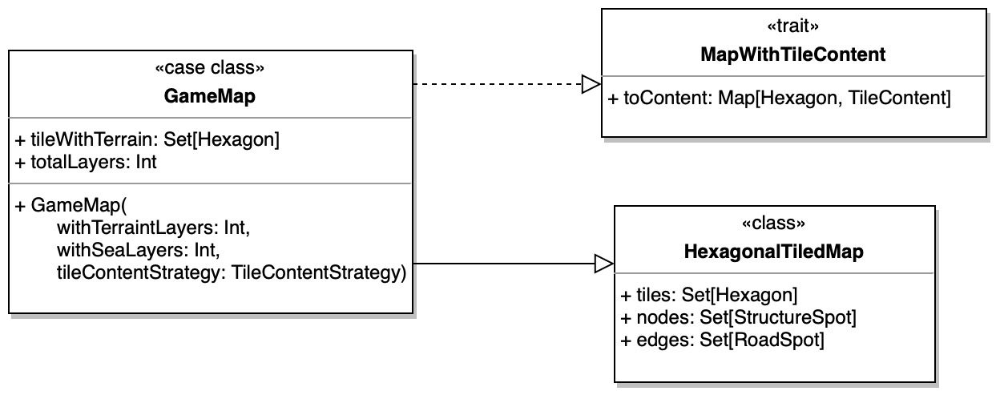

# Design di dettaglio

## Organizzazione del codice

Il codice è organizzato in 5 package principali:

- `model` contiene le classi che implementano la logica di business dell'applicazione, ovvero le regole del gioco e che permettono di gestire il suo svolgimento.
- `views` contiene le entità che permettono di visualizzare lo stato dell'applicazione all'utente e che ne permetto l'interazione diretta tramite un interfaccia grafica.
- `controllers` contiene le entità che permettono di gestire le interazioni dell'utente con l'applicazione, ovvero quelle che implementano la logica di accesso e aggiornamento del Model.
- `utils` contiene le classi di utilità, ovvero quelle che implementano funzionalità di supporto.
- `lib` contiene i module sviluppati che sono diventati parte fondamente del progetto.
  Tra questi troviamo:
  - `mvc` contentente le classi che implementano il pattern architetturale MVC scelto per il progetto e tutte le sue componenti.
  - `game` contentente le classi che implementano un engine di gioco generico, che può essere utilizzato per implementare giochi basati su fasi, step e azioni.
    All'interno di questo package troviamo anche il `dsl` che permette di definire un gioco in modo dichiarativo.

<!--************ MAZZOLI *****************-->

## Architettura

### Model

Si è scelto di gestire il Model come unico stato dell'applicazione, che viene modificato tramite l'aggiornamento dello stesso, applicando un'azione.
Lo stato che viene restituito è quindi sempre un oggetto immutabile che quindi può essere condiviso tra le varie componenti dell'applicazione.

### Controller

Per quanto riguarda la gestione dei Controller si è scelto di automatizzare l'aggiornamento dello stato alla view tramite la creazione di un `ReactiveModelWrapper` che incapsula il vero model e ad ogni modifica dello stato, notifica la view del cambiamento.
La struttura del Controller è ispirata al Cake Pattern, portando quindi il concetto di dipendenza ma venendo poi gestita con il passaggio di tali requirements tramite costruttore.

### View

Anche nelle View sono stati sfruttati i Mixin, in particolare per supportare la navigabilità tra le varie schermate dell'applicazione e per l'integrazione di ScalaJS.
Il Mixin `ScalaJSView` infatti si occupa di gestire le funzionalità di _show_ e _hide_ tramite render con Laminar, mentre il Mixin `NavigatorView` si occupa di gestire la navigazione tra le varie schermate dell'applicazione.
Inoltre la `ScalaJSView` espone anche uno stato reattivo che può essere utilizzato nelle varie View e viene tenuto sempre aggiornato ad ogni modifica propagata dal controller. Questo ha reso molto semplice lo sviluppo delle pagine, in quanto tutto quello mostrato graficamente era dipendente dallo stato reattivo.

#### ViewModel

Per la gestione di tutti i mapping da stato dell'applicazione a singola informazione, è stato creato il concetto di ViewModel, che consiste in un wrapper dello stato reattivo dell'applicazione e che tramite operations su di esso espone già tutti i vari metodi per ottenere le informazioni specifiche.

### Application

Per completare la gestione di MVC si è quindi introdotto il concetto di `ApplicationPage`, ovvero dell'istanza di una pagina dell'applicazione che consiste nella referenza del Model, del Controller e della View.
Il componente responsabile poi della gestione di queste pagine è l'`Application` che si occupa di gestire il mapping dalla `Route` all'istanza di `ApplicationPage` corrispondente.

<!--************ MAZZOLI *****************-->

## Game Engine

### Game

### Rules

<!--************ MAZZOLI *****************-->

## DSL

### PropertiesDSL

### GameDSL

<!--************ MAZZOLI *****************-->

## ScatanGame

### Dominio

### ScatanDSL

<!--************* ---- ****************-->

## Model

### Game

### Map

L'analisi del dominio ha portato alla schematizzazione della mappa di gioco, con i seguenti elementi:

- **Tile**: tassella esagonale che ha un contento
- **Content**: contenuto di un Tile
- **Spot**: incrocio tra 3 Tile adiacenti
- **Road**: connessione tra 2 Spot vicini

A fronte di ciò è stata identificata la classe `GameMap` come entrypoint per questa sotto parte di dominio. In ottica di poter espandere il campo di gioco (AOC), la mappa può essere creata con un numero di _layers_ variabile. Inoltre, per favorire la singola responsabilità dei componenti (SRP), è stato separato il concetto di struttura della mappa e ciò che un tassello può contenere: l'entità appena introdotta mette in relazione i due concetti.

Da ciò ne risulta il seguente schema:

#### Struttura della mappa

La struttura della mappa è rappresentata dalla classe `HexagonalTiledMap`, che si occupa di una costruzione coerente, partendo dall'unità minima, l'`Hexagon`.

Questo componente è basato su [_coordinate cubiche_](https://www.redblobgames.com/grids/hexagons/#coordinates) che permettono di identificare univocamente ogni tassello della mappa.

A seguito della della relazione tra `HexagonalTiledMap` e `Hexagon`, quest'ultimo acquisisce il concetto di spazio con annessi metodi per posizioni relative ed assolute.

La seconda parte di `HexagonalTiledMap` concerne la vista di essa come un _grafo non orientato_:

$$ G = (N, E) $$

Con \\( N \\) insieme dei nodi ed \\( E \\) insieme degli archi, dove \\( E \subseteq V \times V \\).

A partire da ciò è possibile identificare gli `StructureSpot` come nodi del grafo, composti da una tripla non ordinata di 3 `Hexagon` adiacenti, ed i `RoadSpot` come archi, composti da una coppia di 2 `StructureSpot` vicini.

A fronte di questa modellazione nascono le seguenti implicazioni logiche:

- \\( \forall r \in \texttt{Edge} \Rightarrow \\{a, b\\} \\; | \\; a, b \in \texttt{Nodes} \\)
- \\( \forall s \in \texttt{Nodes} \Rightarrow \\{a, b, c\\} \\; | \\; a, b, c \in \texttt{Hexagons} \\)

Inoltre, la distinzione tra `UndirectedGraph` e `UndirectedGraphOps` permette di separare la logica di rappresentazione del grafo da quella che contempla operazioni su di esso.

#### Contenuto dei tasselli

Il contenuto dei tasselli, precedentemente introdotto, è ora approfondito.
La sua funzione è quella di attribuire, ad ogni tassello della mappa, il suo contenuto, che è composto da un terreno ed un numero opzionale.

I terreni possono essere di 2 tipi:

- **Produttivi**: che riutilizzano il concetto di risorsa introdotto nel dominio
- **Non produttivi**: terreni inutili ai fini della produzione di risorse, ma presenti per completare i requisiti del gioco

#### Costruzione della mappa

La creazione della mappa di gioco può essere effettuata attraverso la classe stessa, per libertà di scelta dell'utente, ma sono state predefinite delle _factory_ per far fronte alle esigenze più comuni, date dalle regole del gioco.

Al fine di modificare la mappa, ciò che viene modificato non è la dispozione dei tasselli, ma solo il loro contenuto.
Perciò è possibile definire delle `TileContentStrategy` che permette di modificare il contenuto dei tasselli alla costruzione della mappa stessa.

### Components

## View

La View, come precedentemente introdotto, permette all'utente di visualizzare lo stato dell'applicazione in modo reattivo, e consentire l'interazione con il sistema.
È possibile notare una differente complessità tra le varie schermate dell'applicazione: la schermata di gioco è la più complessa, in quanto deve mostrare lo stato attuale di avanzamente della partita, e consentire le varie interazione permesse, mentre le altre contengono un minor numero di elementi, in quanto devono solo consentire all'utente di proseguire e/o navigare all'interno dell'applicazione.

A fronte di ciò, è stato scelto di utilizzare un approccio a componenti per la realizzazione schermate più dense di elementi, mentre per le altre è stato scelto un approccio più semplice, basato su un unico elemento.

Inoltre, l'approccio a componenti, permette il riutilizzo del codice in sezioni diverse dell'applicazione.

### Context Map e Anti Corruption Layer

L'obiettivo della view di mostrare lo stato del model in modo reattivo contempla la necessità di tradurre le informazioni contenute nel model in elementi grafici, significativi per l'utente.

Il più delle volte, la traduzione è diretta mentre, in alcuni casi, è necessario effettuare delle trasformazioni di contesto, per rendere più significative le informazioni.

Per ovviare a questo problema è stato introdotto il concetto di `Context Map`, luogo che permette di tradurre le informazioni del model in elementi grafici, wrappando il model stesso.

Questo meccanismo funge anche da `Anti Corruption Layer`, in quanto permette di rimuovere la dipendenza diretta tra model e alcune parti della view, risultando l'unico punto dove sono richieste modifiche in caso di cambiamenti nel model.

### ViewModel
