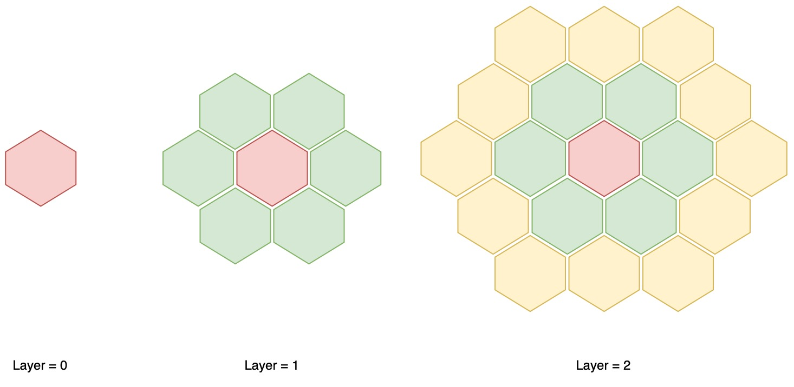
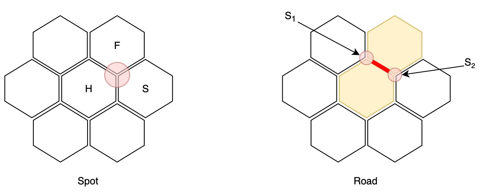

# Implementazione

## Generale

### Tecnologie di dettaglio utilizzate

- [scalajs-dom](https://scala-js.github.io/scala-js-dom/)
- [Laminar](https://laminar.dev)

## Manuel Andruccioli

Il codice prodotto durante lo svolgimento del progetto riguarda prevalentemente le seguente parti:

- Gestione della parte statica della mappa di gioco
  - Esagoni, Spot e Road
  - Mappa come un grafo
  - Contenuto degli esagoni
  - Creazione di essa
- Regole sul posizionamento delle strutture
- Gestione visualizzazione della mappa
- Preview della mappa con possibilità di scelta
- Gestione della CI per building, testing e deployment

Di seguito saranno descritte con maggior dettaglio le parti più salienti.

### Creazione Hexagonal Game Map

**Obiettivo**: creare una game map di dimensioni arbitrariamente grandi, cercando una modellazione quanto più vicina al dominio.
Essa deve permettere di rappresentare _esagoni_, _spot_ e _strade_.
Inoltre, l'implementazione deve poter permettere di accedere in modo intuitivo alle informazioni che la mappa può fornire

#### Tiles

La creazione della game map è partita dall'individuazione dell'unità di base, l'`Hexagon`.

L'articolo [Hexagonal Grids](https://www.redblobgames.com/grids/hexagons/) è stato di grande aiuto per la comprensione del funzionamento di una griglia esagonale e per la scelta della rappresentazione interna degli esagoni, attraverso le coordinate cubiche.

Partendo da questa base teorica è stato possibile creare la mappa a tassellazioni esagonali, con la possibilità di creare mappe di dimensioni arbitrariamente grandi.

Data una `case class Hexagon(r, c, s)` ed imponendo il vincolo:

$$ r + c + s = 0 $$

è possibile possibile generare facilmente una collezione di esagoni che rappresenta le tasselle esagonali della mappa.

```scala
val tiles: Set[Hexagon] =
    (for
        r <- -layers to layers
        c <- -layers to layers
        s <- -layers to layers
        if r + c + s == 0
    yield Hexagon(r, c, s)).toSet
```



#### Spot

Data la collezione di tasselle esagonali, è ora possibile determinare gli _spot_ della mappa.
Essi sono i punti di intersezione tra le esagoni e sono stati ricavati con il seguente ragionamento: dato un esagono qualsiasi \\( H \\), si prendono 2 esagoni \\( F, S \\), adiacenti ad \\( H \\), che, a loro volta, sono adiacenti tra loro.

Ne deriva il seguente codice:

```scala
val nodes: Set[StructureSpot] =
    for
      hex <- tiles
      first <- hex.neighbours
      second <- hex.neighbours
      if first.isNeighbour(second)
    yield UnorderedTriple(hex, first, second)
```

#### Road

Data la collezione di _spot_, è ora possibile determinare le _road_ della mappa.
Esse sono gli archi di collegamento tra 2 _spot_ e sono ricavati con il seguente ragionamento: dati 2 _spot_ qualsiasi \\( S_1, S_2 \\), essi formano un arco se e solo se \\( S_1 \\) e \\( S_2 \\) hanno 2 esagoni in comune.

Ne deriva il seguente codice:

```scala
val edges: Set[RoadSpot] =
    for
        first <- nodes
        second <- nodes
        if (first.toSet & second.toSet).sizeIs == 2
    yield UnorderedPair(first, second)
```



### Hexagon e Monoidi

A fronte di una lettura di [Scala with Cats](https://underscore.io/books/scala-with-cats/), ho voluto sperimentare.

È stato riconosciuto come un `Hexagon` può essere un **monoide** (e garantisce proprietà utili durante la scrittura di codice), in quanto è possibile soddisfare gli assiomi di:

- **associatività**: \\( \forall \\; a,b,c \in S \Rightarrow (a \cdot b) \cdot c = a \cdot (b \cdot c) \\)
- **identità**: \\( \exists \\; \epsilon \in S : \forall a \in S \Rightarrow (\epsilon \cdot a) = a \wedge (a \cdot \epsilon) = a \\)

Ne deriva il seguente codice, utilizzando la libreria [`Cats`](https://typelevel.org/cats/):

```scala
import cats.Monoid
  given Monoid[Hexagon] with
    def empty: Hexagon = Hexagon(0, 0, 0)
    def combine(hex1: Hexagon, hex2: Hexagon): Hexagon =
      Hexagon(
        hex1.row + hex2.row,
        hex1.col + hex2.col,
        hex1.slice + hex2.slice
      )

// An example of usage
def allowedDirections: Set[Hexagon]
// ...
extension (hex: Hexagon)
    def neighbours: Set[Hexagon] =
      import Hexagon.given
      import cats.syntax.semigroup.*
      allowedDirections.map(hex |+| _)
```

### GameMap in view

La visualizzazione della _GameMap_ è stata una parte delicata e complessa, in quanto è stato necessario trovare un modo per rappresentare graficamente, in modo consono, la gli esagoni, spot e road precedentemente introdotti, ma anche per gestire l'interazione dell'utente con gli elementi.

La parte di accesso al model è immediata, data la rappresentazione di esso.

```scala
MapComponent.mapContainer(
    for hex <- gameMap.tiles.toList
    yield svgHexagonWithCrossedNumber(hex),
    for road <- gameMap.edges.toList
    yield svgRoad(road),
    for spot <- gameMap.nodes.toList
    yield svgSpot(spot)
)
```

La parte più complicata è stata la rappresentazione grafica degli elementi, dovendo trovare un _mapping_ su un piano bidimensionale, basato su coordinate cartesiane (dato dalla tecnologia utilizzata, `SVG`).

Innanzitutto è stato introdotto un concetto di `Point`, un punto nel piano cartesiano, che ha permesso di rendere agevole l'utilizzo del sistema di coordinate da dover adottare.
Inoltre, è stato necessario aggiungere un wrapper di `Double` che aggiunge il concetto di precisione, in modo da consentire operazioni sul tipo, senza incorrere in errori di arrotondamento.

Infine, sono stati realizzati metodi di utilità per trattare una coppia di Double come un punto nel piano cartesiano, ma anche per scomporre un punto.

Da ciò derivata la seguente implementazione:

```scala
trait Point:
    def x: DoubleWithPrecision
    def y: DoubleWithPrecision

object Point:
    def unapply(point: Point): (Double, Double) = (point.x.value, point.y.value)

given Conversion[(Double, Double), Point] with
    def apply(pair: (Double, Double)): Point =
        Point(DoubleWithPrecision(pair._1), DoubleWithPrecision(pair._2))
```

#### Nesting di componenti

La costruzione della mappa è stata realizzata attraverso il nesting di componenti, ognuno con diverse proprietà.
In linea di massima, si è sempre cercato di separare la logica di creazione del componente, compreso di ciò che necessità per la resa grafica, dallo stile di visualizzione.

Per far fronte a ciò, ogni componente è corredato dello stretto necessario, con aggiunta di una classe che permette di personalizzare la resa grafica, attraverso i fogli di stile.

> Nota: non tutte le proprietà di svg sono modificabili via css, perciò sono state inserire direttamente nel componente.

Di seguito un esempio:

```scala
...
svg.text(
    svg.x := s"$x",
    svg.y := s"$y",
    svg.className := "spot-text",
    svg.fontSize := s"$radius",
    s"${structureType.getOrElse("")}"
)
...
```

```css
.spot-text {
	fill: black;
	text-anchor: middle;
	dominant-baseline: central;
	font-family: sans-serif;
	font-weight: bold;
}
```

### View TypeUtils

La creazione della view, che necessità di un nesting dei componenti, risulta parecchio prolissa e ripetitiva nel passaggio dei parametri.

Per ovviare a questo problema, ho scelto di nascondere il passaggio dei parametri ridondanti, attraverso l'utilizzo di [`Context Function`](https://docs.scala-lang.org/scala3/reference/contextual/context-functions.html) e la dichiarazione di opportuni tipi, a seconda dell'elemento di contesto che si vuole catturare.

Inoltre, sono stati definiti anche tipi dati da composizioni degli stessi, in modo da catturare più elementi di contesto contemporaneamente.

Alcuni di essi sono ripoortati di seguito:

```scala
  type Displayable[T] = ScatanViewModel ?=> T
  type InputSource[T] = GameViewClickHandler ?=> T
  type DisplayableSource[T] = Displayable[InputSource[T]]
  type InputSourceWithState[T] = InputSource[GameStateKnowledge[T]]
```

La possibilità di catturare il contesto di cui ha bisogno una gerarchia nestata di chiamate a funzioni, in un tipo implicito, ha aperto la possibilità alla realizzazione di semplificazioni.

Di seguito è riportato un frammento esemplificativo:

```scala
def method1: InputSourceWithState[E] =
    // not using ScatanState
    method2

def method2: InputSourceWithState[E] =
    doSomethingWithState(summon[ScatanState])
```

Al contrario, la versione senza Context Function sarebbe stata:

```scala
def method1(state: ScatanState): E =
    // not using ScatanState
    method2(state)

def method2(state: ScatanState): E =
    doSomethingWithState(state)
```

L'esempio è tratto da una semplificazione di `scatan.views.game.components.GameMapComponent#svgHexagonWithCrossedNumber`.

### Test

Il testing, in alcune sue parti, risultava complicato da esprimere perché, ciò che si voleva porre sotto osservazione, erano delle proprietà.

> Esempio: verifica degli assiomi di un _Monoide_

Per ovviare a questo problema ho deciso di esplorare la libreria [`ScalaTest + ScalaCheck`](https://www.scalatest.org/plus/scalacheck), che permette un'integrazione tra i due framework.
Così facendo è stato possibile definire dei test **property-based**.

Di seguito un esempio di test:

```scala
class HexagonTest extends BaseTest with ScalaCheckPropertyChecks:
    "An Hexagon" should "respect the identity law in order to be a Monoid" in {
    forAll { (r: Int, c: Int, s: Int) =>
      val hexagon = Hexagon(r, c, s)
      hexagon |+| Monoid[Hexagon].empty shouldBe hexagon
      Monoid[Hexagon].empty |+| hexagon shouldBe hexagon
    }
  }
```

Qualora un test fallisce, è possibile ottenere i valori che hanno causato il fallimento e, grazie alla pseudo-randomicità, è possibile riprodurre il test.

## Alessandro Mazzoli

Le parti di progetto a cui ho lavorato sono principalmente le seguenti:

- Creazione dell'architettura MVC
- Creazione di un game engine basato su configurazione espresse tramite regole
- Creazione di un DSL per la definizione di regole
- Creazione di un layer anti-corruzione per il gioco che incapsula l'engine.

### MVC

L'architettura MVC è stata ispirata al Cake pattern, infatti possiamo notare come ognuno dei tre componenti abbia ad esempio il concetto di dipendenze, gestite tramite un Mixin che trasforma i requirements in proprietà del componente.

#### Controller

Il controller è stato strutturato come un componente che ha come dipendenze sia il model che la view, in modo da poterli utilizzare all'interno del controller stesso.

```scala
trait Controller[State <: Model.State]:
  def state: State

object Controller:
  trait Requirements[V <: View[?], S <: Model.State] extends Model.Provider[S] with View.Provider[V]

  trait Dependencies[V <: View[S], S <: Model.State](requirements: Requirements[V, S]) extends Controller[S]:
    protected def view: V = requirements.view
    protected def model: Model[S] = requirements.model

  trait Provider[C <: Controller[?]]:
    def controller: C
```

Per gestire gli update della view in maniera automatica è stato introdotto un `ReactiveModelWrapper` che incapsula il vero Model e si occupa di aggiornare la view ogni volta che lo stato del model cambia.

```scala
class ReactiveModelWrapper[S <: Model.State](view: => View[S], model: Model[S]) extends Model[S]:
  private val internalModel = model
  override def state: S = internalModel.state
  override def update(f: S => S): Unit =
    internalModel.update(f)
    view.updateState(this.state)
```

Questo ha permesso la creazione di un controller Base che supportasse automaticamente l'aggiornamento della rispettiva View.

```scala
abstract class BaseController[V <: View[S], S <: Model.State](requirements: Controller.Requirements[V, S])
    extends Controller[S]
    with Controller.Dependencies(requirements):

  override def state: S = model.state
  override protected val model: Model[S] =
    new ReactiveModelWrapper(requirements.view, requirements.model)
```

#### View

Anche il concetto di View è stato creato seguendo la stessa logica a componenti e dipendenze, infatti possiamo vedere come le dipendenze della view consistano solamente nel controller.

```scala
trait View[State <: Model.State]:
  // stuff

object View:
  trait Requirements[C <: Controller[?]] extends Controller.Provider[C]

  trait Dependencies[C <: Controller[?]](requirements: Requirements[C]) extends View[?]:
    protected def controller: C = requirements.controller

  trait Provider[V <: View[?]]:
    def view: V
```

##### Navigator View

Per supportare la navigabilità tra le varie view, ho creato un trait `NavigatorView` che estende `View` e aggiunge i metodi `navigateTo` e `navigateBack` che permettono di navigare tra le varie view.

```scala
trait NavigatorView extends View[?]:
  def navigateTo[Route](route: Route): Unit = NavigableApplicationManager.navigateTo(route)
  def navigateBack(): Unit = NavigableApplicationManager.navigateBack()
```

##### ScalaJS

Per supportare inoltre l'integrazione dell'architettura con ScalaJS, ho optato per l'utilizzo di un altro Mixin che aggiunge la properità `element` che rappresenta il nodo radice della view.
Questo componente inoltre si occupa di esporre lo stato reattivo in modo da poter essere sfruttato dagli elementi grafici poichè mantenuto sempre sincronizzato

```scala
trait ScalaJSView[State <: Model.State](
    val container: String,
    val initialState: State
) extends View[State]:

  private val _reactiveState = Var[State](initialState)
  override def updateState(state: State): Unit =
    _reactiveState.writer.onNext(state)

  /** A signal that emits the current state of the application.
    */
  def reactiveState: Signal[State] = _reactiveState.signal

  /** The element that is rendered by this view.
    */
  def element: Element

  override def show(): Unit =
    // ScalaJS stuff

  override def hide(): Unit =
    // ScalaJS stuff

```

#### Cake Application Page

La costruzione dei vari componenti viene effettuata all'interno dell' `ApplicationPage` che è il componente che si occupa di istanziare la view e il rispettivo controller passandogli le dipendenze richieste.

```scala
trait ApplicationPage[S <: Model.State, C <: Controller[?], V <: View[?]](
    override val model: Model[S],
    val pageFactory: PageFactory[C, V, S]
) extends Model.Requirements[S]
    with View.Requirements[C]
    with Controller.Requirements[V, S]:
  override lazy val view: V = pageFactory.viewFactory(this)
  override lazy val controller: C = pageFactory.controllerFactory(this)
```

Esso infatti al suo interno contiene tutte le dipendenze richieste da tutti i componenti e sfrutta questa proprietà per fare un inizializzazione semplice e veloce.

### Game

Mi sono occupato inoltre dello sviluppo dell'engine di gioco basato su:

- fasi
- step
- azioni

Il core di questo engine è stato costruito per essere immutabile e per mantenere uno snapshot dello stato attuale del gioco.

```scala
final case class Game[State, PhaseType, StepType, ActionType, Player](
    players: Seq[Player],
    state: State,
    turn: Turn[Player],
    gameStatus: GameStatus[PhaseType, StepType],
    playersIterator: Iterator[Player],
    rules: Rules[State, PhaseType, StepType, ActionType, Player]
):
```

Successivamente tramite extension methods sono state esposte le varie funzionalità del gioco quali la possibilità di effettuare delle azioni.

Tale funzionalità è stata modellata sul concetto di effetto, che rende così il concetto di azione indipendente dalla sua implementazione che verrà fornita tramite tale effetto.

```scala
trait Effect[A, S]:
  def apply(state: S): Option[S]
```

Un effetto infatti è relativo ad un azione e consiste in una trasformazione dallo stato attuale ad un altro stato, che può non essere applicabile.

L'implementazione della funzionalità di `play` risulta quindi la seguente, che sfrutta la monade Option per gestire il caso in cui l'effetto non sia applicabile.

```scala
object GamePlayOps:
  extension [State, PhaseType, StepType, Action, Player](game: Game[State, PhaseType, StepType, Action, Player])

    def allowedActions: Set[Action] =
      game.rules.allowedActions(game.gameStatus)

    def canPlay(actionType: Action): Boolean =
      allowedActions.contains(actionType)

    def play(
        action: Action
    )(using effect: Effect[action.type, State]): Option[Game[State, PhaseType, StepType, Action, Player]] =
      for
        _ <- canPlay(action).option
        newState <- effect(game.state)
        newStep = game.rules.nextSteps((game.gameStatus, action))
        newStatus = game.gameStatus.copy(
          step = newStep
        )
        newGame = game.copy(
          state = newState,
          gameStatus = newStatus
        )
      yield
        if newGame.rules.endingSteps(newGame.gameStatus.phase) == newGame.gameStatus.step then newGame.nextTurn.get
        else newGame
```

### DSL

Una volta modellato il concetto di Rules di un gioco, ho iniziato quindi lo sviluppo di un DSL che permettesse di definire le regole di un gioco in modo dichiarativo.

#### PropertiesDSL

Prima di tutto ho definito un insieme di funzionalità core che permettesse la creazione di un dsl generico.
Tale core è basato sul concetto di properietà, in particolare ne abbiamo definite due:

- `OptionalProperty`, che rappresenta una proprietà vuota all'inizio e che può essere modificata tramite l'aggiunta di un valore

- `MultipleProperty`, che rappresenta una proprietà contenente un insieme di valori, inizialmente vuota, che può essere modificata tramite l'aggiunta di un valore

Entrambe le proprietà sono anche `UpdatableProperty`, ovvero proprietà che possono essere aggiornate tramite l'aggiunta di un valore.

```scala
  sealed trait UpdatableProperty[P]:
    def update(newValue: P): Unit

  final case class OptionalProperty[P](var value: Option[P] = None) extends UpdatableProperty[P]:
    override def update(newValue: P): Unit = value = Some(newValue)

  final case class MultipleProperty[P](var value: Seq[P] = Seq.empty[P]) extends UpdatableProperty[P]:
    override def update(newValue: P): Unit = value = value :+ newValue
```

A questo punto per fornire una sintassi dichiarativa ho introdotto il concetto di `PropertyUpdater` che wrappa una property ed espone il metodo `:=` permettendo un utilizzo dichiarativo.

L'utilizzo di una conversione implicita ha permesso di poter utilizzare il metodo direttamente su una proprietà.

```scala
  class PropertySetter[P](property: PropertyUpdater[P]):
    def :=(value: P): Unit = property.update(value)

  given [P]: Conversion[PropertyUpdater[P], PropertySetter[P]] = PropertySetter(_)
```

Stessa metodologia è stata applicata per proprietà la cui assegnazione prevede una fase di building, ovvero di costruzione della stessa.
È stata realizzata quindi la class `PropertyBuilder` che aggiunge un metodo `apply` che prende in input una funzione che ha implicitamente il valore della proprietà in input.

```scala
  private type Builder[P] = P ?=> Unit

  trait Factory[P]:
    def create(): P

  class PropertyBuilder[P: Factory](property: PropertyUpdater[P]):
    def apply(builder: Builder[P]): Unit =
      val obj = summon[Factory[P]].create()
      builder(using obj)
      property.update(obj)

  given [P: Factory]: Conversion[PropertyUpdater[P], PropertyBuilder[P]] = PropertyBuilder(_)
```

Tramite l'utilizzo della factory viene creato l'oggetto che si vuole builder e viene utilizzata la funzione di building specificata, infine viene aggiornata la proprietà con l'oggetto creato.

Tale classe permette l'utilizzo di una sintassi dichiarativa del seguente tipo:

```scala
property {
  ...
  otherProperty {

  }
  ...
}
```

Infine è stato realizzato l `ObjectBuilder` che consiste in un `PropertyBuilder` che ritorna l'oggetto costruito invece che settarlo ad una proprietà

```scala
  class ObjectBuilder[P: Factory]:
    def apply(builder: Builder[P]): P =
      val obj = summon[Factory[P]].create()
      builder(using obj)
      obj
```

Troviamo inoltre un type alias utile per lo sviluppo di funzioni che prendono implicitamente un contesto:

```scala
type Contexted[Ctx, P] = Ctx ?=> P
```

#### GameDSL

Una volta creata la libreria per lo sviluppo di DSL ho iniziato a creare il DSL per la definizione di regole di un gioco.

##### Dominio

Prima di tutto ho definito un dominio di contesti contenti tutte le varie proprietà che andranno settate nella dichiarazione delle regole e che quindi infine verranno convertite ad un oggetto di tipo `Rules`

- `GameCtx` che rappresenta il contesto di un gioco, ovvero quello in cui si definiscono le regole di un gioco.
- `PlayersCtx` che rappresenta il contesto dei giocatori, ovvero quello in cui si definiscono le regole relative ai giocatori.
- `PhaseCtx` che rappresenta il contesto di una fase, ovvero quello in cui si definiscono le regole relative ad una fase del gioco.
- `StepCtx` che rappresenta il contesto di uno step, ovvero quello in cui si definiscono le regole relative ad uno step di una fase del gioco.

Ognuno di esse possiede al suo interno l'insieme delle proprietà che ne vanno a definire il comportamente.

```scala
  case class GameCtx[State, P, S, A, Player](
      phases: MultipleProperty[PhaseCtx[State, P, S, A, Player]] = ...
      players: OptionalProperty[PlayersCtx] = ...
      ...
  )

  case class PlayersCtx(
    allowedSizes: OptionalProperty[Seq[Int]] = ...
  )

  case class PhaseCtx[State, Phase, Step, Action, Player](
      initialStep: OptionalProperty[Step] = ...
      endingStep: OptionalProperty[Step] = ...
      steps: MultipleProperty[StepCtx[Phase, Step, Action]] = ...
      ...
  )

  case class StepCtx[Phase, Step, Action](
      when: MultipleProperty[(Action, Step)] = ...
      ...
  )
```

Infine tramite operations su tali contesti sono state definite le funzionalità di creazione del dsl in modo che ognuna di esse si riferisca ad una proprietà all'interno del contesto che sta costruendo.

La più importante è sicuramente la funzione `Game` che permette la creazione di un `GameCtx`:

```scala
  def Game[State, Phase, Step, Actions, Player] =
    ObjectBuilder[GameCtx[State, Phase, Step, Actions, Player]]()
```

Questo abilita la creazione di un contesto di gioco tramite la seguente sintassi:

```scala
val gameCtx = Game {
  ...
}
```

Nella quale la funzione passata prende in input implicitamente il contesto di gioco e può quindi settare le varie proprietà, tramite le operazioni su quei contesti definiti.

Ad esempio le operazioni sul `GameCtx` sono le seguenti:

```scala
object GameCtxOps:

  /** Define the winner function, which is a function that takes a game state and returns the winner of the game, if
    * any.
    */
  def WinnerFunction[State, Player]
      : Contexted[GameCtx[State, ?, ?, ?, Player], PropertySetter[State => Option[Player]]] =
    ctx ?=> ctx.winner

  /** Define a phase of the game.
    */
  def Phase[State, Phase, Step, Action, Player]: Contexted[GameCtx[State, Phase, Step, Action, Player], PropertyBuilder[
    PhaseCtx[State, Phase, Step, Action, Player]
  ]] =
    ctx ?=> ctx.phases

  /** Define the Players info of the game.
    */
  def Players: Contexted[GameCtx[?, ?, ?, ?, ?], PropertyBuilder[PlayersCtx]] =
    ctx ?=> ctx.players

  /** Define the initial phase of the game.
    */
  def InitialPhase[Phase]: Contexted[GameCtx[?, Phase, ?, ?, ?], PropertySetter[Phase]] =
    ctx ?=> ctx.initialPhase
```

Queste funzionalità hanno quindi lo scopo di esporre le proprietà del contesto preso implicitamente e di permetterne la configurazione in maniera dichiarativa, utilizzando le conversioni implicite della libreria della proprietà.

Quello che si è cercato quindi di emulare sono funzioni in cui è necessario un contesto implicito sopra al quale vengono chiamate operazioni senza la necessità di dover specificare il receiver.

#### ScatanDSL

Il dsl creato mi ha permesso di definire le regole del gioco nel seguente modo:

```scala
private val game = Game[ScatanState, ScatanPhases, ScatanSteps, ScatanActions, ScatanPlayer] {

    Players {
      CanBe := (3 to 4)
    }

    WinnerFunction := winner
    InitialPhase := ScatanPhases.Setup

    Phase {
      PhaseType := ScatanPhases.Setup
      InitialStep := ScatanSteps.SetupSettlement
      EndingStep := ScatanSteps.ChangingTurn
      NextPhase := ScatanPhases.Game
      Iterate := Iterations.OnceAndBack

      Step {
        StepType := ScatanSteps.SetupSettlement
        when := ScatanActions.AssignSettlement -> ScatanSteps.SetupRoad
      }
      Step {
        StepType := ScatanSteps.SetupRoad
        when := ScatanActions.AssignRoad -> ScatanSteps.ChangingTurn
      }
    }
    Phase {
      PhaseType := ScatanPhases.Game
      InitialStep := ScatanSteps.Starting
      EndingStep := ScatanSteps.ChangingTurn
      OnEnter := { (state: ScatanState) => state.assignResourcesAfterInitialPlacement.get }
      Iterate := Iterations.Circular

      Step {
        StepType := ScatanSteps.Starting
        when := ScatanActions.RollDice -> ScatanSteps.Playing
        when := ScatanActions.RollSeven -> ScatanSteps.PlaceRobber
        when := ScatanActions.PlayDevelopmentCard -> ScatanSteps.Starting
      }
      Step {
        StepType := ScatanSteps.PlaceRobber
        when := ScatanActions.PlaceRobber -> ScatanSteps.StealCard
      }
      Step {
        StepType := ScatanSteps.StealCard
        when := ScatanActions.StealCard -> ScatanSteps.Playing
      }
      Step {
        StepType := ScatanSteps.Playing
        when := ScatanActions.BuildSettlement -> ScatanSteps.Playing
        when := ScatanActions.BuildRoad -> ScatanSteps.Playing
        when := ScatanActions.BuildCity -> ScatanSteps.Playing
        when := ScatanActions.BuyDevelopmentCard -> ScatanSteps.Playing
        when := ScatanActions.PlayDevelopmentCard -> ScatanSteps.Playing
        when := ScatanActions.TradeWithBank -> ScatanSteps.Playing
        when := ScatanActions.TradeWithPlayer -> ScatanSteps.Playing
        when := ScatanActions.NextTurn -> ScatanSteps.ChangingTurn
      }
    }
}
```

## Luigi Borriello

Per quanto riguarda il mio contributo al progetto, mi sono occupato principalmente delle seguenti parti:

- Modellazione dello stato della partita, dei singoli componenti relativi a quest'ultimo, e delle loro corrispondenti operazioni nonchè:
  - Gestione delle carte risorse
  - Gestione delle carte sviluppo
  - Gestione delle costruzioni
  - Gestione dei punteggi
  - Gestione dei certificati
  - Gestione degli scambi intra-giocatore
  - Gestione degli scambi con la banca
- Realizzazione grafica degli scambi
- Contributo parziale alla realizzazione di tutte le schermate dell'applicazione  


Di seguito saranno descritte con maggior dettaglio le parti più salienti.

### Creazione e modellazione dei singoli componenti della partita
Per la modellazione dello stato della partita, come prima cosa, ho individuato quelle che sarebbero state le sue componenti principali, individuando così le entità dei **buildings**, le **resource cards**, le **development cards**, i **trades**, gli **awards** e gli **scores**.

Una volta individuati, ho subito organizzato le eventuali strutture dati necessarie a modellarli, cercando di mantenere una certa coerenza tra di esse, e soprattutto con il dominio del gioco.

Dopo di che, per facilitare la lettura e sviluppo del codice stesso, ho optato per definire per ognuno dei componenti, dei **type alias**, corrispondenti a codeste strutture dati, in modo da poterle utilizzare in modo più semplice e diretto.

Di seguito, sono riportati due esempi di definizione di **type alias**:

- `ResourceCards`:
```scala
/** Type of possible resources.
  */
enum ResourceType:
  case Wood
  case Brick
  case Sheep
  case Wheat
  case Rock

/** A resource card.
  */
final case class ResourceCard(resourceType: ResourceType)

/** The resource cards hold by the players.
  */
type ResourceCards = Map[ScatanPlayer, Seq[ResourceCard]]
````

- `Awards`:

```scala
/** Type of possible awards.
  */
enum AwardType:
  case LongestRoad
  case LargestArmy

/** An award
  */
final case class Award(awardType: AwardType)

/** The assigned awards to the current holder player and the number of points.
  */
type Awards = Map[Award, Option[(ScatanPlayer, Int)]]
```

### Modellazione dello stato della partita

In concomitanza alla realizzazione di questi componenti, ho iniziato a modellare anche quella che sarebbe stata l'entità principale dello stato della partita, scegliendo di utilizzare una **case class** chiamata `ScatanState`, contenente solo le informazioni necessarie per poter catturare i vari snapshot dello stato della partita durante il suo svolgimento.

```scala
final case class ScatanState(
    players: Seq[ScatanPlayer],
    gameMap: GameMap,
    assignedBuildings: AssignedBuildings,
    assignedAwards: Awards,
    resourceCards: ResourceCards,
    developmentCards: DevelopmentCards,
    developmentCardsDeck: DevelopmentCardsDeck,
    robberPlacement: Hexagon
)
```

### Realizzazione delle ScatanState Ops

Dopo aver individuato quelle che sarebbero state le principali operazioni da poter effettuare sullo stato della partita, ho deciso di raggrupparle e dividerle in più moduli, ognuno relativo ad una specifica sotto-parte del dominio. Riuscendo così a rendere le varie funzionalità indipendenti (o semi-indipendenti) tra loro.

Per fare ciò, ho realizzato all'interno del package `scatan.model.game.state.ops` una serie di **object** ognuno dei quali contiene una serie di **extension methods** per la case class `ScatanState`, in modo da poterla arricchire di funzionalità.

Inoltre, per favorire un approccio più funzionale, ho deciso di realizzare tutti questi metodi senza side-effect, facendo in modo che ogni volta che verrà effettuata una modifica allo stato della partita, verrà ritornato un `Option[ScatanState]` contenente il nuovo stato della partita, o `None` altrimenti, permettendo agli strati superiori dell'applicazione di catturare eventuali errori e gestirli di conseguenza.

Di seguito, viene riportato un esempio di definizione dell' **object** contenente le **extension methods** per la gestione delle **resource cards**:

```scala
/** Operations on [[ScatanState]] related to resource cards.
  */
object ResourceCardOps:

  extension (state: ScatanState)
    /** Assigns a resource card to a player.
      */
    def assignResourceCard(player: ScatanPlayer, resourceCard: ResourceCard): Option[ScatanState] =
      Some(
        state.copy(
          resourceCards = state.resourceCards.updated(player, state.resourceCards(player) :+ resourceCard)
        )
      )

    /** Removes a resource card from a player.
      */
    def removeResourceCard(player: ScatanPlayer, resourceCard: ResourceCard): Option[ScatanState] =
      if !state.resourceCards(player).contains(resourceCard) then None
      else
        val remainingCardsOfSameType =
          state.resourceCards(player).filter(_.resourceType == resourceCard.resourceType).drop(1)
        val remainingCardsOfDifferentType =
          state.resourceCards(player).filter(_.resourceType != resourceCard.resourceType)
        Some(
          state.copy(
            resourceCards =
              state.resourceCards.updated(player, remainingCardsOfDifferentType ++ remainingCardsOfSameType)
          )
        )
```


### Operazioni tail recursive

Nello sviluppo delle operazioni sullo stato, ho posto una particolare enfasi sull'utilizzo pervasivo della funzione `foldLeft` per l'elaborazione delle informazioni in molte delle nostre strutture dati. L'obiettivo di questa scelta è stato duplice: da un lato, ottimizzare le prestazioni del codice attraverso l'uso di questa funzione altamente efficiente; d'altro lato, migliorare la coerenza e la leggibilità del codice, aumentandone la dichiaratività.

Di seguito, viene riportato un esempio di utilizzo di `foldLeft` nella gestione dei **trades**:

```scala
    /** Trade between two players. The sender must have the senderCards and the receiver must have the receiverCards The
      * sender will give the senderCards to the receiver and vice versa
      */
    def tradeBetweenPlayers(
        sender: ScatanPlayer,
        receiver: ScatanPlayer,
        senderCards: Seq[ResourceCard],
        receiverCards: Seq[ResourceCard]
    ): Option[ScatanState] =
      val stateWithSenderCardsProcessed = senderCards.foldLeft(Option(state))((s, card) =>
        for
          initialState <- s
          stateWithCardRemovedFromSender <- initialState.removeResourceCard(sender, card)
          stateWithCardAssignedToReceiver <- stateWithCardRemovedFromSender.assignResourceCard(receiver, card)
        yield stateWithCardAssignedToReceiver
      )
      val stateWithReceiverCardsProcessed = receiverCards.foldLeft(stateWithSenderCardsProcessed)((s, card) =>
        for
          initialState <- s
          stateWithCardRemovedFromReceiver <- initialState.removeResourceCard(receiver, card)
          stateWithCardAssignedToSender <- stateWithCardRemovedFromReceiver.assignResourceCard(sender, card)
        yield stateWithCardAssignedToSender
      )
      stateWithReceiverCardsProcessed

```

<!-- FoldLeft -->
<!-- For comprension -->

### Calcolo degli Scores

Per implementare il modulo dedicato al calcolo dei punteggi, come prima cosa, è stato definito tramite la libreria **cats**, un semigruppo per il tipo `Scores`, in modo da poter dichiarare come combinare più elementi di questo tipo:

```scala
import cats.kernel.Semigroup

/** A Map that contains for each player the number of points they have
  */
type Scores = Map[ScatanPlayer, Int]

object Scores:

  given Semigroup[Scores] with
    def combine(x: Scores, y: Scores): Scores =
      x ++ y.map { case (player, score) =>
        player -> (score + x.getOrElse(player, 0))
      }
```

Successivamente, ho definito una serie di funzioni, ognuna delle quali si occupa di calcolare il punteggio dei giocatori secondo un criterio specifico, ottenendo così più punteggi "parziali". 

Di seguito, viene riportato un esempio di definizione di una di queste funzioni:

```scala
/** Computes the partial scores of each player, taking into account the development cards they have assigned. A
      * victory point card is worth 1 point.
      */
    private def partialScoresWithVictoryPointCards: Scores =
      val playersWithVictoryPointCards =
        state.developmentCards.filter(_._2.exists(_.developmentType == DevelopmentType.VictoryPoint)).map(_._1)
      playersWithVictoryPointCards.foldLeft(Scores.empty(state.players))((scores, player) =>
        scores.updated(player, scores(player) + 1)
      )
```

Infine, ho combinato queste funzioni di punteggio parziale mediante l'operazione di combine (`|+|`). Questo processo di combinazione ha permesso di ottenere una funzione di punteggi totali:

```scala
/** This method calculates the total scores of all players in the game by combining the partial scores with awards
      * and buildings. It uses the `|+|` operator from the `cats.syntax.semigroup` package to combine the scores.
      * @return
      *   the total scores of all players in the game.
      */
    def scores: Scores =
      import cats.syntax.semigroup.*
      import scatan.model.components.Scores.given
      val partialScores = Seq(partialScoresWithAwards, partialScoresWithBuildings, partialScoresWithVictoryPointCards)
      partialScores.foldLeft(Scores.empty(state.players))(_ |+| _)
```

### Testing
L'implementazione di tutte le operazioni sullo stato con tipo di ritorno opzionale, rischiava di rendere più macchinosa la fase di testing, e di rendere il codice di quest'ultima confuso e poco leggibile se non gestito correttamente. 

Per ovviare a questo problema, è stato utilizzato in maniera pervasiva il costrutto `for comprehension`, ottenendo così codice più pulito e meno suscettibile a errori dovuti alla gestione dei valori opzionali.

Di seguito, viene riportato un esempio di utilizzo di `for comprehension` nella fase di testing:

```scala
  it should "assign a LargestArmy award if there are conditions" in {
    val state = ScatanState(threePlayers)
    val player1 = threePlayers.head
    val stateWithAward = for
      stateWithOneKnight <- state.assignDevelopmentCard(player1, DevelopmentCard(DevelopmentType.Knight))
      stateWithTwoKnight <- stateWithOneKnight.assignDevelopmentCard(player1, DevelopmentCard(DevelopmentType.Knight))
      stateWithThreeKnight <- stateWithTwoKnight.assignDevelopmentCard(player1, DevelopmentCard(DevelopmentType.Knight))
    yield stateWithThreeKnight
    stateWithAward match
      case Some(state) => state.awards(Award(AwardType.LargestArmy)) should be(Some((player1, 3)))
      case None        => fail("stateWithAward should be defined")
  }
```


## Pair programming
