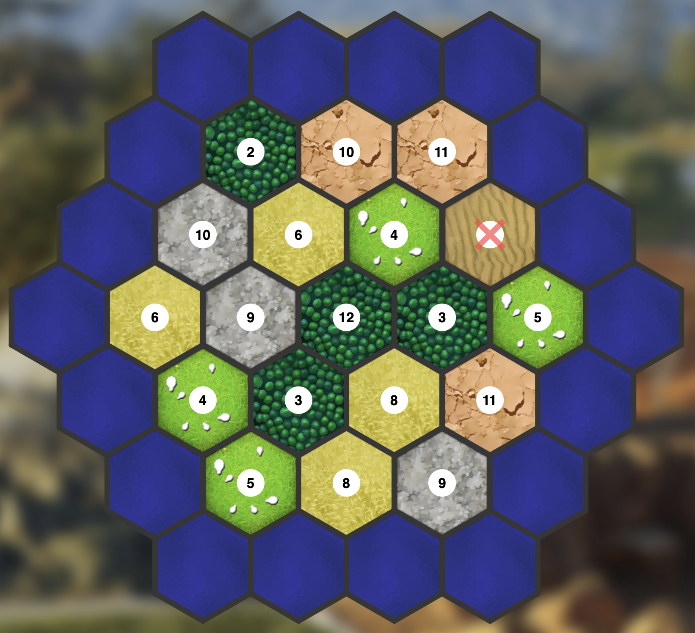
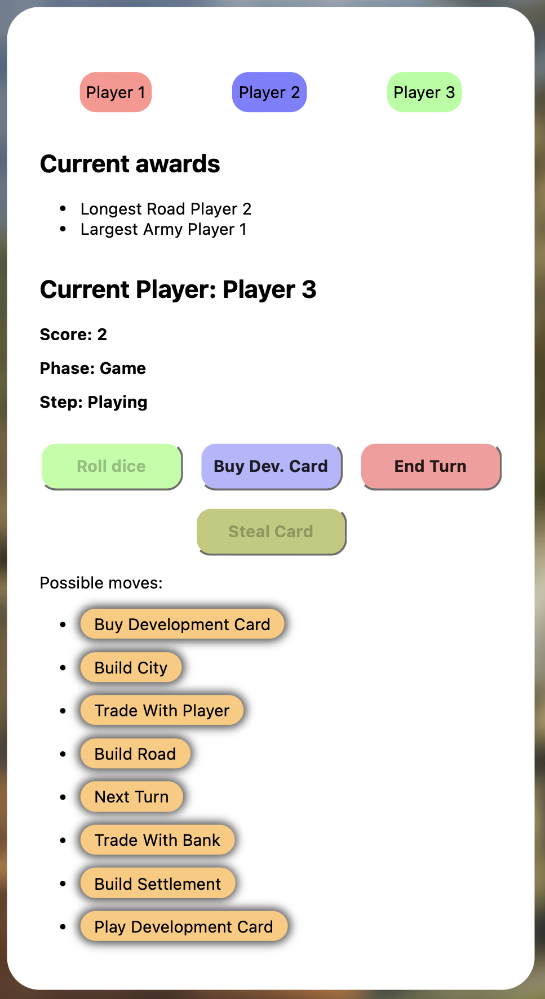
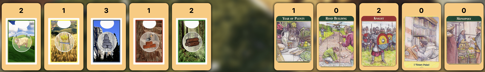
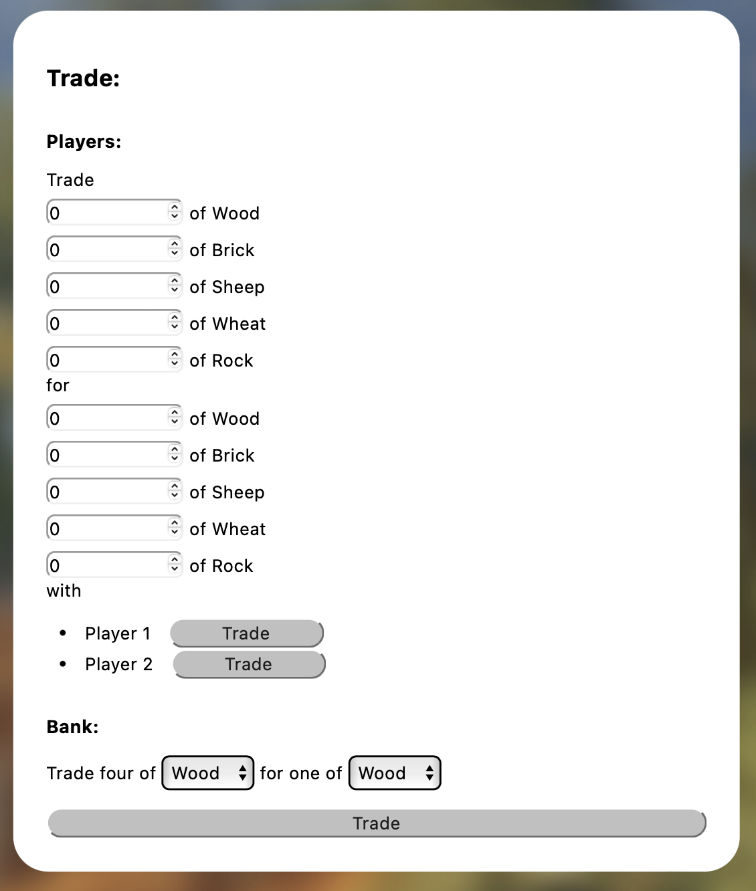
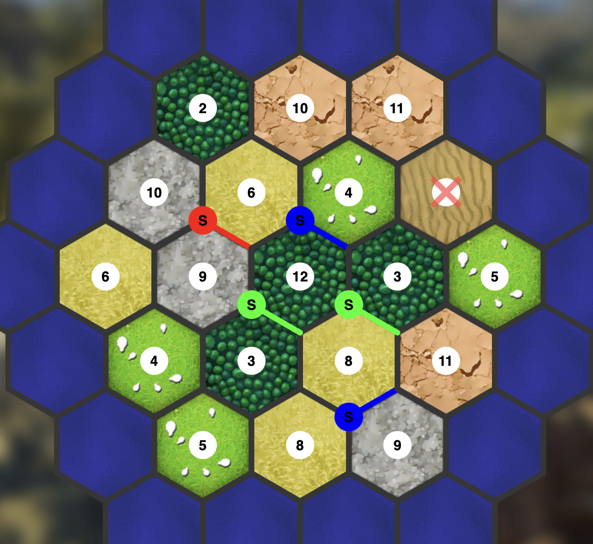
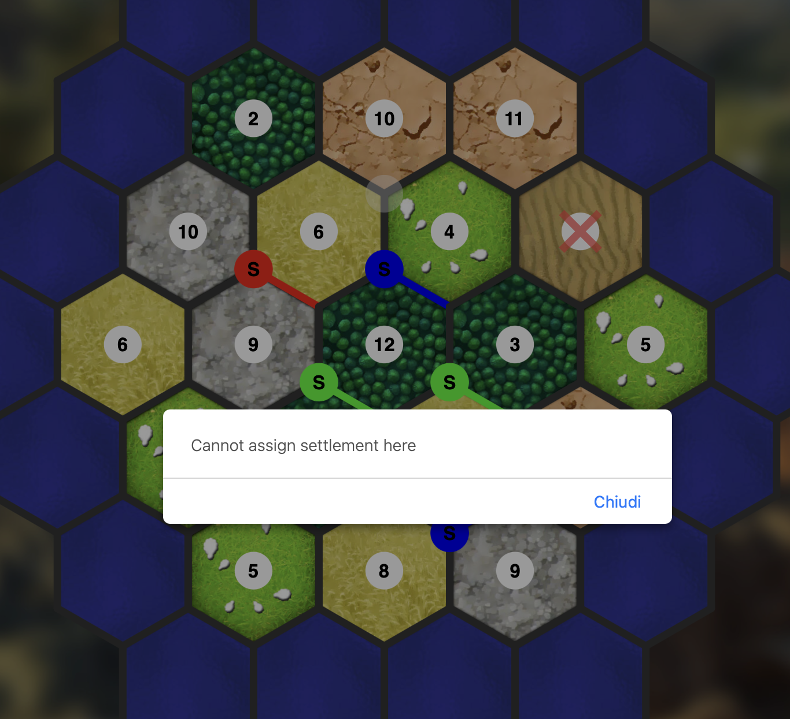
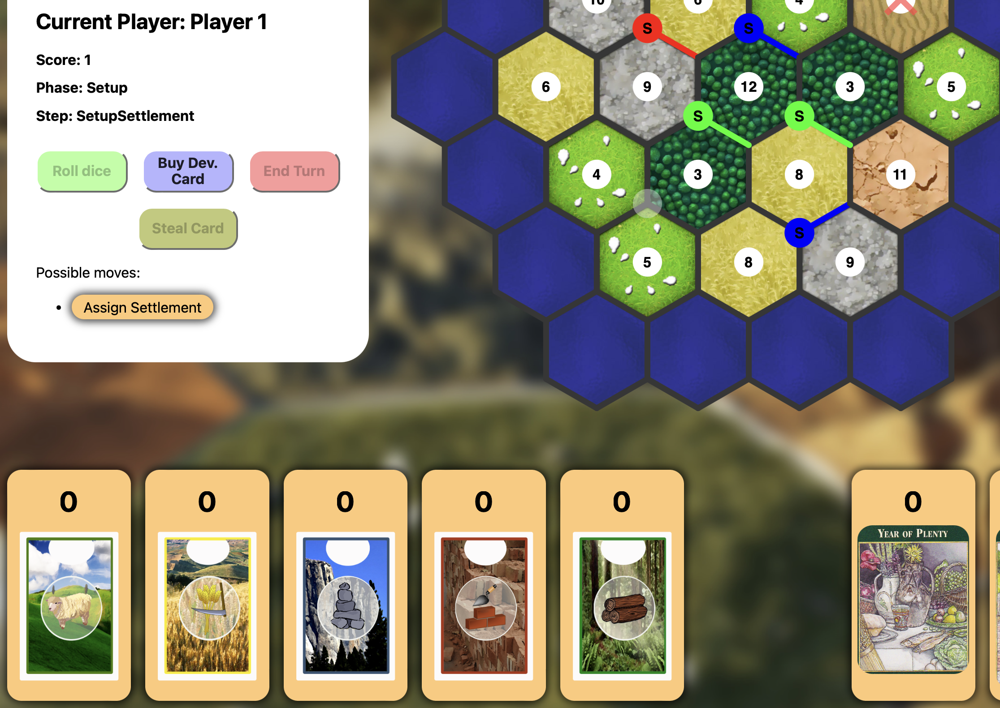
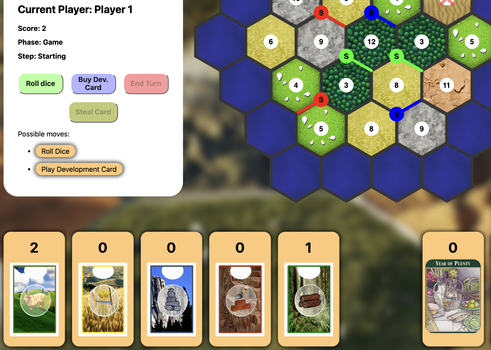

# Guida utente

## Schermata iniziale

## Schermata di setup

## Schermata di gioco

### Campo di gioco

### Pannello informazioni e mosse

### Zona carte del giocatore

### Pannello di scambio

## Posizionamento iniziale

Gli utenti posizionano le strutture iniziali seguendo le regole del gioco:

- Si posiziona prima il settlement e poi la strada
- Ordine: `P1 -> P2 -> P3 -> P3 -> P2 -> P1`

> **Regola**: per costruire un settlment è necessario che, negli spot adiacenti, non ci siano altre strutture!

## Risorse iniziali

`Player 1` posiziona il suo secondo settlement e la sua seconda strada

e riceve le risorse corrispondenti alle tasselle su cui ha costruito.

