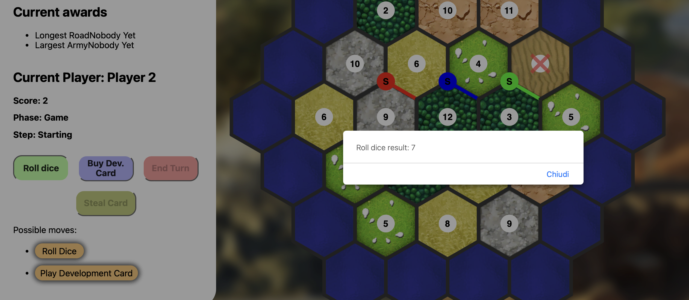

# Guida utente

## Schermata iniziale [R1]

## Schermata di setup [R2]

### Scelta casuale della mappa [R2.1]

## Schermata di gioco [R3]

### Campo di gioco [R3.1]

### Pannello informazioni e mosse [R3.2]

### Zona carte risorsa [R3.3]

### Zona carte development [R3.4]

### Pannello di scambio [R3.5]

## Posizionamento iniziale [R4]

Gli utenti posizionano le strutture iniziali seguendo le regole del gioco:

- Si posiziona prima il settlement e poi la strada
- Ordine: `P1 -> P2 -> P3 -> P3 -> P2 -> P1`

> **Regola**: per costruire un settlement è necessario che, negli spot adiacenti, non ci siano altre strutture!

## Risorse iniziali [R5]

`Player 1` posiziona il suo secondo settlement e la sua seconda strada

e riceve le risorse corrispondenti alle tasselli su cui ha costruito.

## Robber [R6]

### Lancio dei dadi con risultato 7 [R6.1]

### Rubare una carta ad un avversario [R6.2]

### Carta rubata [R6.3]

